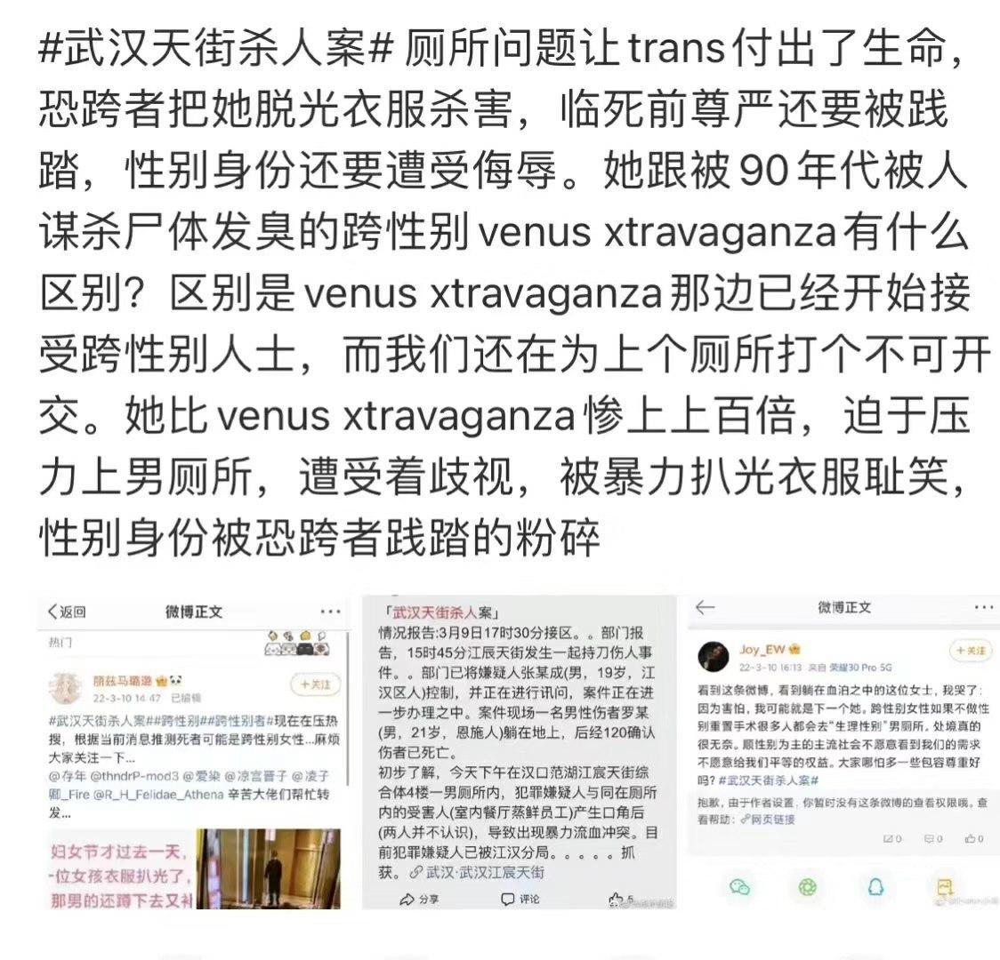
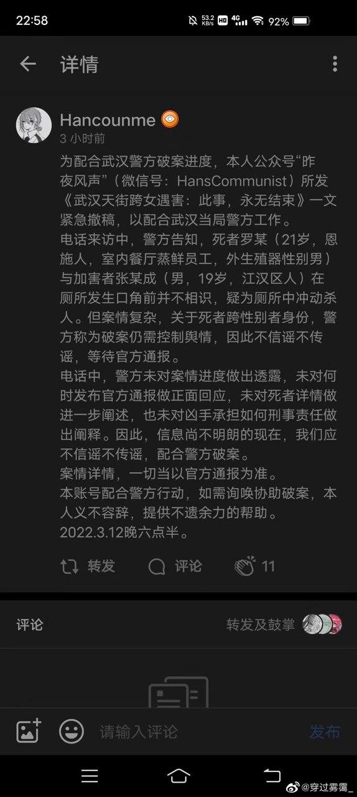
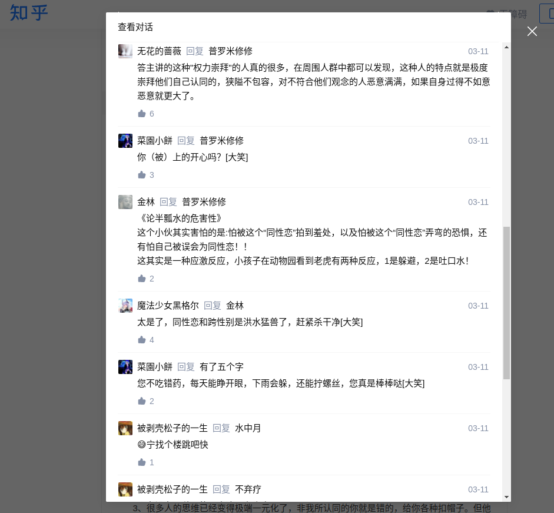

## 事件简介
### 2022年3月10日
社交媒体网络平台上开始流传一起骇人听闻的持刀伤人事件。后经非正式官方通报得知事件经过如下（存疑,非官方途径）:

> 2022年3月9日17时30分接区域部门报告，当日15时45分中国武汉江辰天街发生一起恶性持刀伤人事件。嫌疑人张某成（男，19岁，武汉江汉区人）已被控制，正在进行讯问，案件正在进一步办理。案件现场一名男性伤者罗某（男，21岁，恩施人）躺在地上，后经120确认伤者已死亡。
> 初步了解，当日下午武汉汗门口范湖江宸天街综合楼四楼一男厕所内，犯罪嫌疑人与同在厕所内的受害人（室内餐厅蒸鲜员工）发生口角后（二人并不相识），导致出现暴力流血冲突。目前犯罪嫌疑人已被江汉分局抓获。

据各类真实性存疑的现场描述，受害人最后上身赤裸倒在血泊中，施暴人手持凶器仍然做出过攻击行为。

后续各类媒体社交平台有关这一事件的消息均被封杀，言论遭到管控。因此很多信息真实性有待确定。目前相关信息仍然等待官方通报。 ~~又或许永远等不到通报~~

### 2022年3月12日
一自媒体公众号“昨夜风声”（微信号：HansCommunist）所发文章《武汉天街跨女遇害：此事，永无结束》一文紧急撤稿，以配合武汉当局警方工作。

## 后记
记录这个事件，是这个初春时节最寒冷的一笔。更加寒冷的是整个社会，网络，媒体对这一事件的态度。诚然在这之中仍然能听到一些善良的声音，但是对比那些恶意的评论显得渺小无助。以下内容摘自[某知乎文章](https://zhuanlan.zhihu.com/p/479043103)下的评论。

### 反乌托邦的幻想
尝试用反乌托邦的想象力去构想这个事件的结局，但愿事实并非如此：

若干时间之后，正式通报如下：

>某年某月某日两男子在商场厕所引发争执，最后嫌疑人使用随身携带刀具将另一方捅死。经认定此事件为严重暴力冲突事件。嫌疑人被指控故意杀人罪判处无期徒刑。

死者的父母在法庭上据理力争拿到了不算太满意的赔偿，心中有无悲伤之感并没有人知道。杀人者锒铛入狱。跨性别被榨干了生命最后的价值后不知道有没有城市公墓的一角不知有没有人祭拜。墓碑上最后残忍的写着“xxx之子罗xx......”

当互联网的金鱼记忆消失，没有人会记得这件事情。阳光依旧明媚，世界依旧歌舞升平......

## 引用
1. [知乎-武汉天街事件的思考](https://zhuanlan.zhihu.com/p/479043103)

